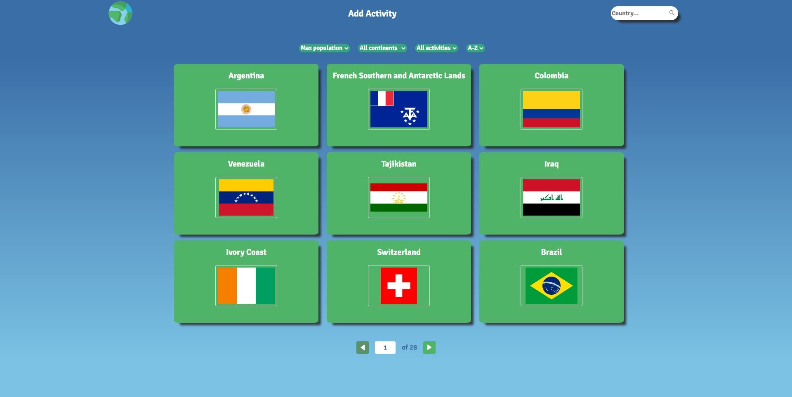
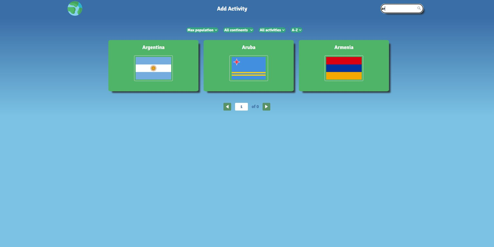
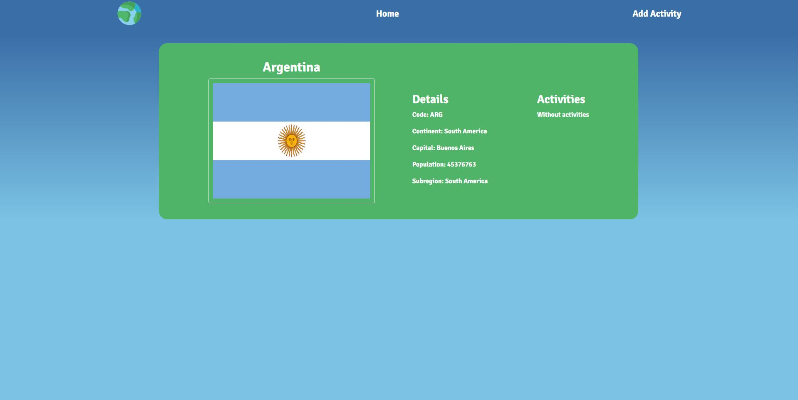
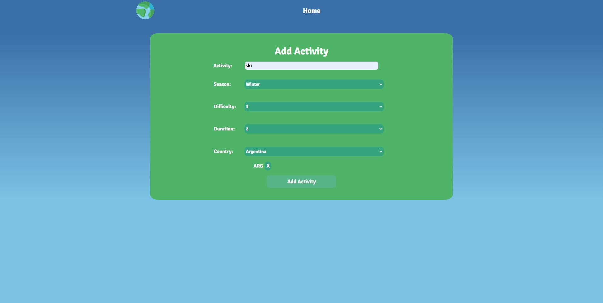
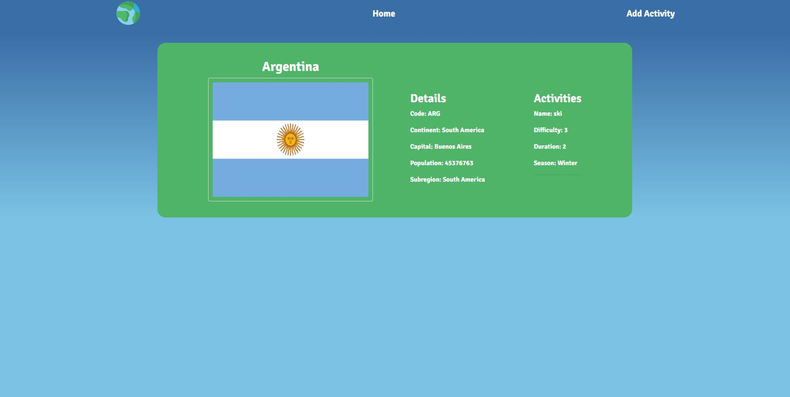

# Individual Project - Henry Countries

## Objetivos del Proyecto

- Construir una App utlizando React, Redux, Node y Sequelize.
- Afirmar y conectar los conceptos aprendidos en la carrera.
- Aprender mejores prácticas.
- Aprender y practicar el workflow de GIT.
- Usar y practicar testing.

## Enunciado

Algunas de sus funcionalidades son:

  - Buscar paises
  - Filtrarlos / Ordenarlos
  - Crear actividades turísticas

#### Tecnologías necesarias:
- [ ] React
- [ ] Redux
- [ ] Express
- [ ] Sequelize - Postgres

## Previews

